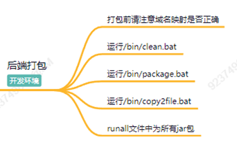
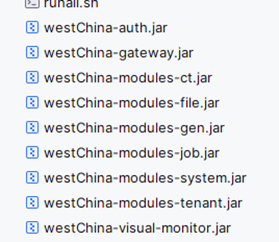
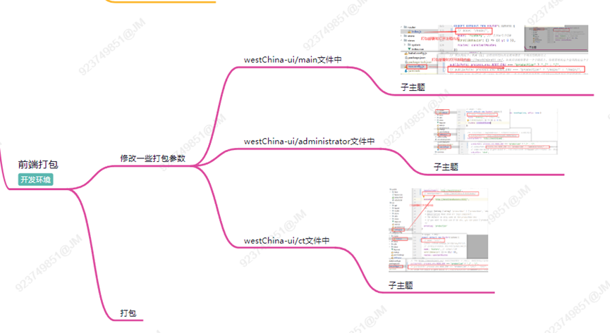
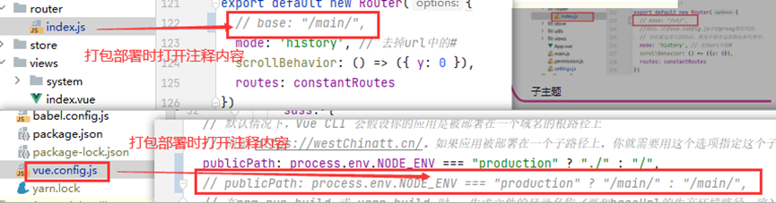
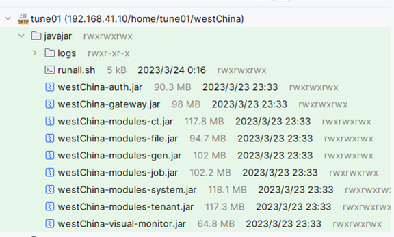
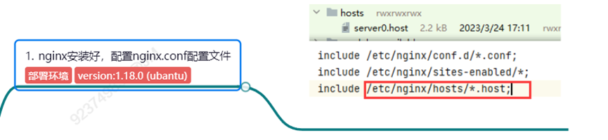

# CT阅片多租户管理系统
# 快速了解
1. CT阅片系统：
   - 病灶标记等功能
   - CT影像上传管理
   - 影像管理
2. 管理系统
   - 基于多租户模式，SaaS平台软件，可提供多个医院使用
   - 软件可扩展
   - 数据源物理隔离
   - 基于微服务
# 项目部署或开发
开发或部署步骤参考[思维导图](https://www.processon.com/view/link/6523b3a0ec6dd11d4673142f)
也可以参考xueyi-cloud的部署流程，大致相当，理解xueyi-cloud的部署过程，就理解了本项目的部署过程
## 部署或二次开发所需服务：
- Redis==5.0.7，其他版本未测试
- RabbitMQ==3.8.11
- jdk1.8
- mysql8
- nacos>=2.0+
- sentinel==1.8.6
- minio  ==  RELEASE.2023-02-10T18-48-39Z
- nginx==1.18.0
## 开发环境：
- jdk1.8
- node18.12.1
- maven3.8.1
- navicat （非必须）查看数据库
- IDE : idea或其它
## 项目的发布和部署
### 后端打包
1. 首先执行clean.bat文件，清理target里面的文件
2. 然后打包，执行package.Bat

   

3. 打包好的jar包如下:

   
4. 
### 前端打包



上面三个图如下：




打包：
```
cd main && npm run build:prod
cd administrator && npm run build:prod
cd ct && npm run build:prod
```


### 后端启动

上传到服务器：



**运行 sh runall.sh start all 即可全部启动**

### 前端启动
安装好nginx ,并配置好


设置服务启动文件参数


重启nginx即可
访问http://westchinaui:5000/即可
### 各类服务以及端口对应关系

# 部分功能阅览：


# 项目说明
本项目：
- 管理系统的开发基于[xueyi-cloud](https://gitee.com/xueyitiantang/XueYi-Cloud)项目，感谢@xueyitiantang的开源
- CT标记系统基于[cornerstone.js](https://github.com/cornerstonejs/cornerstone)工具进行二次研发。感谢相关人员的开源支持


# 肿瘤识别项目推荐(有兴趣的同志可以为本系统添加该部分功能)：

1：基于深度学习的肿瘤辅助诊断系统，以图像分割为核心，利用人工智能完成肿瘤区域的识别勾画并提供肿瘤区域的特征来辅助医生进行诊断。有完整的模型构建、后端架设、工业级部署和前端访问功能。
https://github.com/xming521/CTAI


2：肺分割项目
https://github.com/paulmtree/Lung-Segmentation-Project

3：肿瘤检测应用
https://github.com/Klepackp/azure_tumor_recognition

4：differential-feature-map-neural-network-DFNN-
 https://github.com/hzluyali/differential-feature-map-neural-network-DFNN-

5:视频
https://www.bilibili.com/video/BV1kG411T7tr/?spm_id_from=333.337.search-card.all.click&vd_source=f4140c1808e7f9c6e8d8aacb45614ae1

6：【肺结节识别】3D Deep Leaky Noisy-or Network论文
https://zhuanlan.zhihu.com/p/51922663
https://github.com/lfz/DSB2017