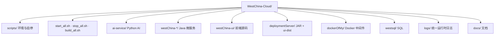

# WestChina-Cloud · CT 阅片多租户管理系统

基于微服务 + 多租户的胸部 CT 阅片平台，支持 DICOM 管理、病灶 AI 识别（方案 A/B/C）、租户数据源物理隔离。

## 功能概览

| 子系统 | 路径 | 说明 |
|--------|------|------|
| 管理系统 | `/main/` | 租户、策略、菜单、数据源 |
| 租户管理 | `/administrator/` | 租户侧组织与权限 |
| CT 阅片 | `/ct/` | DICOM 浏览、手动/AI 病灶标记 |

## 快速开始（Linux / WSL2）

```bash
cd WestChina-Cloud

# 1. 初始化环境（Docker + JDK + Node + 数据库）
bash scripts/setup_env.sh base

# 2. （可选）AI 引擎 + GPU
bash scripts/setup_env.sh ai-engines
bash scripts/setup_env.sh gpu

# 3. 编译
bash build_all.sh

# 4. 启动
bash start_all.sh core

# 5. 状态检查
bash scripts/status.sh
```

浏览器访问 http://127.0.0.1:5000/main/ ，账号 **superadmin / superadmin**。

同事远程访问（Sealtun 隧道 `westchina-ui`）：https://sealtun-westchina-ui-ns-km83ebvo.sealosgzg.site/main/（详见 [docs/12-sealtun-remote-access.md](docs/12-sealtun-remote-access.md)）

## 文档索引

| 文档 | 说明 |
|------|------|
| [docs/DEPLOY.md](docs/DEPLOY.md) | **从零部署完整教程**（推荐首次阅读） |
| [docs/README.md](docs/README.md) | 全部文档目录 |
| [docs/12-sealtun-remote-access.md](docs/12-sealtun-remote-access.md) | Sealtun 远程访问（固定公网地址） |
| [ai-service/README.md](ai-service/README.md) | AI 推理服务（方案 A/B/C、API、环境变量） |
| [westsql/readme.txt](westsql/readme.txt) | SQL 脚本与租户子库 |
| [logs/README.md](logs/README.md) | 运行时日志目录说明 |
| [scripts/README.md](scripts/README.md) | 脚本清单 |
| [dockerOfMy/README.md](dockerOfMy/README.md) | Docker 中间件 |

## 技术栈

- 后端：Spring Cloud（Gateway / Auth / System / Tenant / CT / File …），JDK 8，Maven
- 前端：Vue 2 + Element UI（main / administrator / ct）
- 中间件：MySQL 8、Redis、RabbitMQ、Nacos、MinIO（Docker Compose）
- AI：Python FastAPI + TotalSegmentator + MONAI / nnDetection（方案 B 需 GPU）

## 项目结构（精简）


```mermaid
flowchart TB
  Root["WestChina-Cloud/"]
  Root --> scripts["scripts/ 环境与启停"]
  Root --> start["start_all.sh · stop_all.sh · build_all.sh"]
  Root --> ai["ai-service/ Python AI"]
  Root --> java["westChina-*/ Java 微服务"]
  Root --> ui["westChina-ui/ 前端源码"]
  Root --> deploy["deploymentServer/ JAR + ui-dist"]
  Root --> docker["dockerOfMy/ Docker 中间件"]
  Root --> sql["westsql/ SQL"]
  Root --> logs["logs/ 统一运行时日志"]
  Root --> docs["docs/ 文档"]
```

> **说明**：Linux/WSL 请使用 `scripts/` 与根目录 `*_all.sh`。`deploymentServer/logs` 是指向 `logs/java/` 的符号链接。

## 致谢

- 管理系统基于 [XueYi-Cloud](https://gitee.com/xueyitiantang/XueYi-Cloud)
- CT 阅片基于 [cornerstone.js](https://github.com/cornerstonejs/cornerstone) 二次开发
