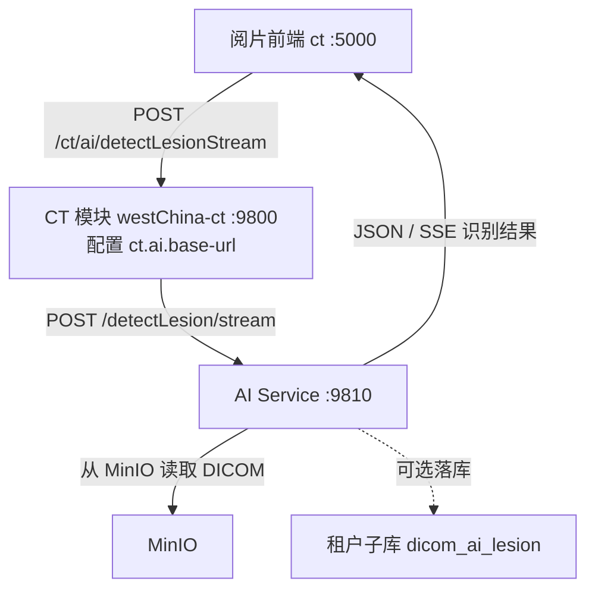
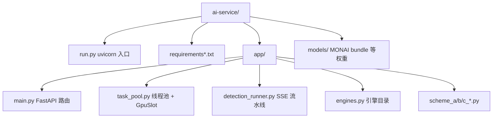

# CT AI 推理服务

> Python FastAPI 服务，默认端口 **9810**。为阅片前端提供胸部 CT 病灶识别（方案 A/B/C）与 SSE 进度推送。

---

## 1. 在整体架构中的位置



**说明：** AI 服务地址在 Nacos / `CtAiProperties` 中配置（`ct.ai.base-url`），不写入数据库。

---

## 2. 三种识别方案

| 方案 ID | 名称 | 模式 | GPU | 依赖 | 输出 |
|---------|------|------|:---:|------|------|
| `scheme-a` | 肺区智能筛查 | 全序列 / 当前层 | 否* | TotalSegmentator | 病灶轮廓 + 置信度 + HU |
| `scheme-b` | 融合精准分析 | 仅全序列 | **是** | TotalSegmentator + MONAI/nnDetection | 统一 lesions 分色（实性/磨玻璃/混合/钙化） |
| `scheme-c` | 单层异常倾向 | 仅当前层 | 否* | PyTorch + torchvision | 原图分辨率 HU 异常热力图 |

\* CPU 可运行；方案 B 强制要求 CUDA。

### 方案 A — 肺区分割 + 形态学 + HU 分类

1. `robust_ct_loader` 从 MinIO 加载序列，按 IPP 排序，并记录 **文件序号映射**（`file_slice_indices`）。
2. TotalSegmentator / 2D 回退做肺野 mask。
3. `hu_utils.nodule_candidate_mask` 在肺野内筛选 GGO / 实性 / 高密度候选。
4. 3D 连通域过滤（体积、实心度、跨层连续性、肺门抑制）。
5. `classify_nodule_hu` 按临床 HU 范围分类，输出 `contour`（归一化坐标）与 `sliceIndex`（**已映射为前端 stack 序号**）。

关键文件：`scheme_a_detector.py`、`hu_utils.py`、`lung_segment_2d.py`。

### 方案 B — 深度学习检测 + 融合过滤 + 统一 lesions 输出

1. MinIO 并行下载；可选**体数据磁盘缓存**（同序列二次分析跳过下载）。
2. TotalSegmentator **肺野 + 肺叶**（默认**跳过**血管 TS）；失败时肺叶 bbox 启发式 fallback。
3. 子引擎（`detectSubEngine`）：`auto`（nnDet 优先）/ `monai` / `nndet`。
4. DL 3D 检测 → **P1 融合过滤**（肺野、空气占比、HU、形态）→ **enrich**（框内 HU 轮廓 + `classify_nodule_hu` 分型 + 肺叶）。
5. GGO 可插拔后端（`off` / `adaptive` / `heuristic` / `model`）；**默认 `off`**，结果合并进 `lesions`；`ggoRegions` 恒为空数组兼容旧客户端。
6. 可选配对增强 CT（`enhancedSeriesUid`）计算 `deltaHu` / `enhancementHint`。
7. 输出：`markerType` / `colorKey` / `subType` / 胸膜距离 / 空泡征等。

关键文件：`scheme_b_fusion.py`、`lesion_enrichment.py`、`scheme_b_filter.py`、`detection_runner.py`、`volume_cache.py`。

### 方案 C — 单层 HU 异常热力图

1. 仅处理当前层 HU 数组（`pixel_array × RescaleSlope + RescaleIntercept`）。
2. 体内 mask 排除空气 / 皮肤边缘。
3. 肺实质内 GGO/实性偏离 + 高密度灶（约 +80～+280 HU）生成热力图。
4. **不以 Grad-CAM 边缘为主**（避免皮肤/背景假阳性）。
5. 返回 `heatmap.values`（与原图同宽高的一维数组）。

关键文件：`scheme_c_screening.py`、`hu_utils.py`。

---

## 3. HTTP API

### `GET /health`

```json
{
  "status": "ok",
  "gpuAvailable": true,
  "engine": "scheme-a/b/c",
  "engines": [ { "id": "scheme-a", "available": true, ... } ],
  "detectWorkers": 4,
  "gpuConcurrentSlots": 1,
  "gpuConcurrentMode": "auto",
  "gpuDevices": [
    { "index": 0, "name": "NVIDIA ...", "vramTotalGb": 8.0, "recommendedSlots": 1 }
  ],
  "schemeBVramGbPerJob": 6.0,
  "gpuVramReserveGb": 1.5
}
```

`engines` 与 `/engines` 相同；`detectWorkers` / `gpuConcurrentSlots` 来自 `task_pool.pool_stats()`，用于确认并发与显存槽位。

### `GET /engines`

返回引擎目录（与 `/health` 中 `engines` 相同）。

- **缓存**：`engines.py` 内 `refresh_engine_catalog()`，TTL **60 秒**，避免每次请求重复探测重型依赖。
- **预热**：服务 `startup` 时后台线程 `force=True` 构建目录，缩短首个请求的等待时间。
- **可用性**：scheme-a 看 TotalSegmentator；scheme-b 另需 CUDA；scheme-c 看 PyTorch。

### `POST /detectLesion`

同步识别（少用，CT 模块主要用 stream）。

### `POST /detectLesion/stream`

SSE 事件流。请求体示例：

```json
{
  "bucket": "tenant-bucket",
  "studyUid": "1.2.3...",
  "seriesUid": "1.2.4...",
  "dicomCtPath": "path/to/series/",
  "imageCount": 48,
  "bodyPart": "CHEST",
  "detectEngine": "scheme-a",
  "detectMode": "series",
  "detectSubEngine": "auto",
  "enhancedSeriesUid": "1.2.840....enhanced",
  "enhancedImageCount": 474,
  "currentSliceIndex": 12,
  "sliceIndex": 12
}
```

| 字段 | 说明 |
|------|------|
| `detectEngine` | `scheme-a` / `scheme-b` / `scheme-c` |
| `detectMode` | `series` 全序列 / `single` 当前层 |
| `detectSubEngine` | 仅方案 B：`auto` / `monai` / `nndet` |
| `enhancedSeriesUid` | 可选：配对增强 CT 序列 UID（scheme-b ΔHU） |
| `enhancedImageCount` | 增强序列层数 |
| `sliceIndex` | 当前层在 **前端 stack** 中的 0-based 序号 |

SSE 事件类型：`progress`、`log`、`stats`、`result`、`error`。

**并发模型**（`main.py` + `task_pool.py`）：

1. FastAPI 路由 `async`，但推理在 **`ThreadPoolExecutor`**（`AI_DETECT_WORKERS`）中执行，避免阻塞 `/engines`。
2. scheme-b 进入推理前经 **`GpuSlot`** 占用 GPU 信号量；槽位数由 `AI_GPU_CONCURRENT` 控制（默认 `auto` 按显存推算）。
3. `uvicorn` 进程数由 `AI_WORKERS` 控制（默认 2），进一步隔离长推理与元数据请求。

scheme-b 融合在**子进程**中执行（`fusion_subprocess.py`），主进程按固定阶段推送 progress（准备→下载→体数据→融合→ΔHU→完成），无伪心跳进度。

---

## 4. 环境变量

| 变量 | 默认 | 说明 |
|------|------|------|
| `AI_HOST` | `0.0.0.0` | 监听地址 |
| `AI_PORT` | `9810` | 端口 |
| `MINIO_ENDPOINT` | `127.0.0.1:9000` | MinIO 地址 |
| `MINIO_ACCESS_KEY` | `admin` | MinIO 密钥 |
| `MINIO_SECRET_KEY` | `admin123456` | MinIO 密钥 |
| `SERIES_MAX_SLICES_CPU` | `128` | CPU 全序列最大层数（超出则降采样） |
| `AI_LOG_JSON` | `true` | 结构化 JSON 日志 |
| `AI_LOG_PATH` | `logs/ai-service/ai-service.log` | 日志路径 |
| `NNDET_LUNA16_WEIGHT_DIR` | - | nnDetection 权重目录 |
| `AI_LOG_LEVEL` | `INFO` | 日志级别 |
| `AI_WORKERS` | `2` | uvicorn 进程数 |
| `AI_DETECT_WORKERS` | `min(CPU,4)` 至少 2 | 推理线程池大小 |
| `AI_GPU_CONCURRENT` | `auto` | GPU 并发槽：`auto` 或整数 `1`/`2`/… |
| `AI_SCHEME_B_VRAM_GB` | `6.0` | 估算单路 scheme-b 显存占用（GB） |
| `AI_GPU_VRAM_RESERVE_GB` | `1.5` | 为系统/CUDA 预留显存（GB） |

结节筛选相关见 `app/config.py`（`MIN_NODULE_MM`、`GGO_HU_MIN` 等）。

### 方案 B 专用环境变量

| 变量 | 默认 | 说明 |
|------|------|------|
| `SCHEME_B_SKIP_VESSEL_SEG` | `true` | 跳过血管 TS（依赖形态学过滤） |
| `SCHEME_B_VOLUME_CACHE` | `true` | 体数据磁盘缓存 |
| `SCHEME_B_GGO_BACKEND` | `off` | GGO 后端：off/adaptive/heuristic/model |
| `GGO_MODEL_DIR` | - | GGO ONNX/TorchScript 权重目录 |
| `SCHEME_B_LUNG_SEG` | `totalsegmentator` | 肺分割：totalsegmentator/hu/stack2d/monai |
| `SCHEME_B_TS_PARALLEL` | `true` | 肺叶+血管 TS 并行（需 `SCHEME_B_SKIP_VESSEL_SEG=false`） |
| `SCHEME_B_WATERSHED_CONTOUR` | `false` | 框内 watershed 轮廓细化 |
| `AI_DISCLAIMER_SCHEME_B` | （见 config） | 方案 B 免责声明文案 |
| `MINIO_PARALLEL_DOWNLOAD` | `true` | 并行 MinIO 下载 |

验收脚本：`scripts/verify_scheme_b.py`、`scripts/scheme_b_gold_checklist.py`、`scripts/compare_detectors.py`。

---

## 5. 安装与启动

### 5.1 基础依赖（必需）

```bash
cd ai-service
python3 -m venv .venv    # 或使用 .conda
source .venv/bin/activate
pip install -r requirements.txt
```

### 5.2 AI 引擎（按需）

```bash
# 方案 A/B：TotalSegmentator
pip install -r requirements-totalsegmentator.txt

# 方案 B：MONAI RetinaNet bundle
pip install -r requirements-monai.txt

# 方案 C：PyTorch（CPU）
pip install torch torchvision

# GPU 版 PyTorch（方案 B 推荐）
bash ../scripts/install-pytorch-gpu.sh
```

或使用项目脚本：

```bash
bash scripts/setup_env.sh ai-engines   # CPU 引擎
bash scripts/setup_env.sh gpu          # GPU PyTorch
```

### 5.3 启动

```bash
# 推荐：项目根目录
bash scripts/start-ai.sh

# 或手动
cd ai-service && .conda/bin/python run.py
```

验证：

```bash
curl http://127.0.0.1:9810/health
curl http://127.0.0.1:9810/engines
```

---

## 6. 目录结构



---

## 7. HU 与坐标约定

### HU 换算

```
HU = pixel_value × RescaleSlope + RescaleIntercept
```

每张 DICOM 单独读取 `(0028,1053)` / `(0028,1052)`，与阅片探针一致。

### 病灶分类参考（`classify_nodule_hu`）

| HU 范围 | 类型 |
|---------|------|
| -850 ~ -280 | 磨玻璃 |
| 12 ~ 90 | 实性结节 |
| 80 ~ 280 | 高密度（钙化/增强） |

### 前端标记

- `bbox` / `contour` 坐标为 **相对图像宽高归一化** [0, 1]。
- `sliceIndex` 为 **MinIO 文件顺序**（0-based），与 Cornerstone stack 的 `currentImageIdIndex` 一致。
- 有 `contour` 时前端只绘制轮廓，不绘制虚线矩形。

---

## 8. 常见问题

### `/engines` 或前端引擎下拉「全部不可用」

1. 确认 AI 进程正常：`curl http://127.0.0.1:9810/health`
2. 确认 `/engines` 能快速返回：`time curl http://127.0.0.1:9810/engines`
3. 经 CT 代理：`curl http://127.0.0.1:9800/ai/engines`（Java 使用 30s 读超时）
4. 若长推理期间仍超时：检查是否已部署 **多 worker + 引擎缓存 + 线程池**（见 `run.py`、`engines.py`、`task_pool.py`）
5. 重启：`bash scripts/start-ai.sh`；前端 Ctrl+F5

### `/engines` 中 scheme-a/b `available: false`（依赖未装）

```bash
pip install -r requirements-totalsegmentator.txt
```

### scheme-b 提示 GPU 不可用

```bash
nvidia-smi
bash scripts/install-pytorch-gpu.sh
```

### 标记位置与探针 HU 对不上

1. 确认 AI 服务已更新（含 `slice_index_map`）。
2. 前端硬刷新（Ctrl+Shift+R）。
3. 对比同一 `sliceIndex` 层，而非 IPP 排序后的内部层号。

### 方案 C 热力图在体外高亮

确认已部署最新 `scheme_c_screening.py`（体内 HU 异常 mask，非 Grad-CAM 边缘）。

### 识别结果无法保存到序列

租户子库需有 `dicom_ai_lesion` 表：

```bash
bash scripts/init-tenant-db.sh <数据库名> docker
```

表结构见 `westsql/slave-init.sql`。

---

## 9. 相关文档

- [部署与开发指南](../docs/DEPLOY.md)
- [Sealtun 远程访问](../docs/12-sealtun-remote-access.md)
- [SQL 与租户子库](../westsql/readme.txt)
