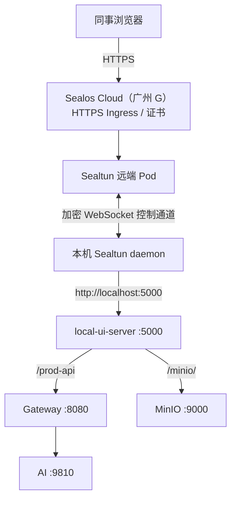
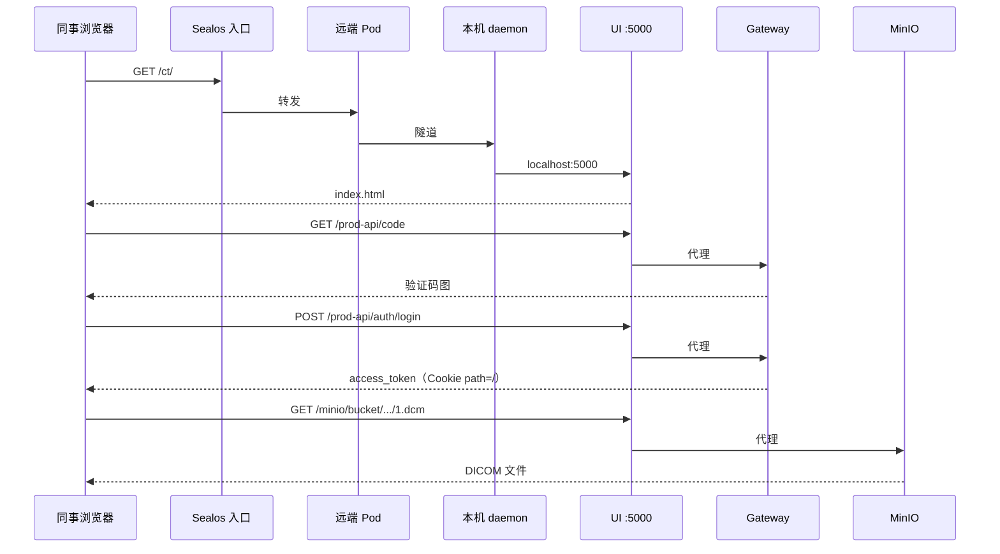
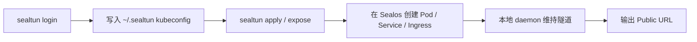
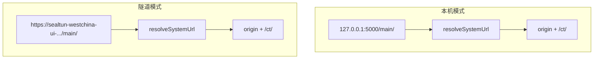

# Sealtun 远程访问完整指南

> 让同事通过公网访问本机 WestChina（仅暴露 UI :5000）。  
> Sealtun 项目源码：[../../sealtun](../../sealtun)

---

## 1. 适用场景

| 场景 | 推荐方式 |
|------|----------|
| 本机自己开发 | `http://127.0.0.1:5000/main/` |
| 同事临时演示 / 联调 | **Sealtun 隧道**（本文） |
| 长期生产、固定域名 | 部署到云服务器（华为云 ECS 等），不用隧道 |

WestChina 的 UI 入口已统一在 **5000** 端口：`local-ui-server.js` 代理 `/prod-api` → Gateway、`/minio/` → MinIO，**只需暴露 5000**。

---

## 2. 整体架构（原理）



**要点：**

- 同事访问的是 Sealos 上的 **HTTPS 入口**，不是你的家庭公网 IP。
- 远端 Pod 与本地 **daemon** 保持长连接，把 HTTP 请求转发到 `localhost:5000`。
- Java / AI / MinIO 不直接暴露公网，全部经 UI 同源代理。

---

## 3. 请求时序（一次打开 CT 阅片）



---

## 4. Sealtun CLI 在本地的角色



| 组件 | 位置 | 作用 |
|------|------|------|
| `sealtun` CLI | 本机 | 登录、创建/停止隧道、绑域名 |
| `~/.sealtun/` | 本机 | 登录态、session、kubeconfig |
| 远端 Pod | Sealos K8s | 公网入口与转发 |
| daemon | 本机后台 | 维持与 Pod 的长连接 |

更细的 CLI 说明见 [sealtun/QuickStart.md](../../sealtun/QuickStart.md)。

---

## 5. 快速教程

### 5.1 安装与登录

```bash
npm install -g sealtun
# 或: npx sealtun --version

sealtun login gzg    # 广州 G，与当前隧道区域一致
```

浏览器完成 Sealos 设备授权（`https://gzg.sealos.run/oauth2/device?user_code=...`）。

### 5.2 启动 WestChina

```bash
cd WestChina-Cloud
bash start_all.sh core
bash scripts/status.sh
```

### 5.3 创建 / 恢复隧道

```bash
# 推荐：声明式配置（隧道名 westchina-ui，域名固定）
npx sealtun apply -f sealtun.yaml

# 或 start_all.sh 自动恢复（见 scripts/start-sealtun.sh）
bash scripts/start-sealtun.sh

# 临时演示（会生成随机 ID，不推荐长期使用）
npx sealtun expose 5000
```

当前项目 **Public URL**（`westchina-ui` 隧道，与 `sealtun.yaml` 一致）：

**`https://sealtun-westchina-ui-ns-km83ebvo.sealosgzg.site`**

执行 `bash start_all.sh core` 或 `bash scripts/start-sealtun.sh` 会恢复该隧道，**域名不变**。

### 5.4 访问地址

| 系统 | 路径 |
|------|------|
| 管理端 | https://sealtun-westchina-ui-ns-km83ebvo.sealosgzg.site/main/ |
| CT 阅片 | https://sealtun-westchina-ui-ns-km83ebvo.sealosgzg.site/ct/ |
| 租户端 | https://sealtun-westchina-ui-ns-km83ebvo.sealosgzg.site/administrator/ |

登录：**superadmin / superadmin**（企业账号与员工账号均填 superadmin）+ 验证码。

### 5.5 管理端跳转 CT / 租户

数据库 `xy_system.route` 使用**相对路径** `/ct/`、`/administrator/`。  
前端 `resolveSystemJumpUrl()` 会根据当前浏览器地址自动拼接：

- 本机访问 → `http://127.0.0.1:5000/ct/`
- 隧道访问 → `https://<隧道>/ct/`

登录 Cookie 已设为 `path=/`，管理端登录后进入子系统可共享 token。

### 5.6 停止与恢复

```bash
npx sealtun list
npx sealtun stop <tunnel-id>      # 暂停，省费用
npx sealtun start <tunnel-id>     # 恢复，域名一般不变
npx sealtun cleanup <tunnel-id>   # 删除隧道资源
```

---

## 6. 自定义域名（华为云等）

可以绑定自己在华为云注册的域名，**但流量仍走 Sealos 隧道，Sealos 资源费仍要付**。


```bash
npx sealtun domain plan <tunnel-id> westchina.example.com
# 在华为云 DNS 添加 CNAME: westchina.example.com -> <sealos-host>

npx sealtun domain add <tunnel-id> westchina.example.com --wait --timeout 5m
```

| 费用 | 说明 |
|------|------|
| 华为云 | 域名注册/续费 + DNS（通常很少） |
| Sealos | 隧道 Pod CPU/内存 + 端口 + **流量**（与是否自定义域名无关） |

长期固定域名 + 省隧道费：应把 WestChina **部署到华为云 ECS**，域名 A 记录指 ECS，而不是长期跑 Sealtun。

---

## 7. 时效与计费

### 7.1 隧道会过期吗？

默认 `sealtun expose` **不设 TTL**（`sealtun list` 中 `EXPIRES AT` 为 `-`），会一直可用，直到：

- 你执行 `stop` / `cleanup`
- 本机关机或 daemon 退出
- Sealos 账号欠费、资源被回收

若在 `sealtun.yaml` 里写了 `ttl: 2h`，到期后 daemon 会自动清理远端资源。

### 7.2 费用从哪里来？

Sealtun **不收单独软件费**，费用来自 Sealos 为隧道分配的云资源：

- 远端 Pod：CPU + 内存（按小时）
- 公网 HTTPS 入口：端口（按小时）
- 出网流量（按 GB）

详见 [sealtun/README.md#计费说明](../../sealtun/README.md)。

### 7.3 充值

1. 打开 https://gzg.sealos.run（与 `sealtun login gzg` 同区）
2. 费用中心 → 充值（微信/支付宝）
3. 欠费可能导致隧道 Pod 停止；充值后执行 `npx sealtun start <id>`

---

## 8. 常见问题

### 浏览器反复弹 “Sign in”

原因：隧道开了 **HTTP Basic Auth**，前端 XHR 不会自动带隧道密码。  
解决：重建隧道时**不要**加 `--basic-auth`，仅用系统登录页保护。

### 管理端能进，CT 跳转到 127.0.0.1

原因：数据库仍是绝对地址。  
解决：执行 `scripts/init-local-db.sh` 或确认 `xy_system.route` 为 `/ct/`、`/administrator/`，并重新编译前端。

### 远程 DICOM 加载失败

确认 CT 前端已用 `getMinioUrl()`（同源 `/minio/`），并 `bash build_all.sh frontend-only`。

### 隧道 502

检查本机 `bash scripts/status.sh`，确认 UI :5000 与 Gateway :8080 正常。

### 隧道上传很慢

上传走完整链路：`浏览器 → Sealos → 本机 UI → Gateway → CT 服务 → MinIO`。  
大文件 DICOM 建议本机直连 `127.0.0.1:5000` 上传，或部署到云服务器后再远程测试。

### 重置测试数据

硬删除租户与 MinIO 数据（保留 `xy-cloud` 主库 superadmin）：

```bash
bash scripts/reset-tenant-data.sh --yes
```

---

## 9. 项目内相关文件

| 文件 | 说明 |
|------|------|
| `sealtun.yaml` | 声明式隧道配置 |
| `scripts/expose-sealtun.sh` | 一键暴露脚本 |
| `scripts/reset-tenant-data.sh` | 重置租户/MinIO 测试数据 |
| `deploymentServer/local-ui-server.js` | UI 与代理 |
| `westChina-ui/common/src/utils/systemUrl.js` | 本机/隧道链接解析 |
| `docs/DEPLOY.md` 附录 D | 部署文档中的 Sealtun 摘要 |

---

## 10. 与本地开发对照



同一套前端与数据库配置，**无需手动改链接**；只要从对应入口打开并重新登录一次即可。
