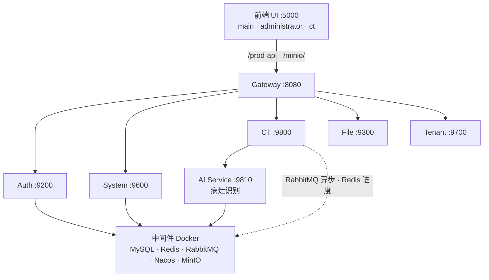
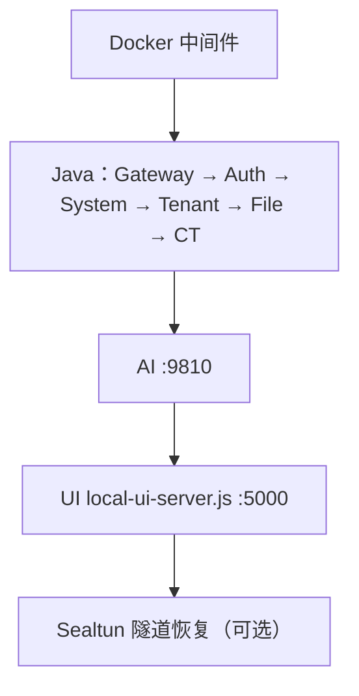
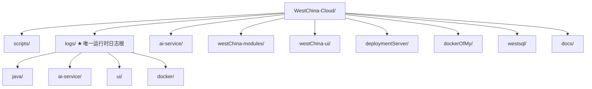

# WestChina-Cloud 从零部署指南

> 场景：全新 Ubuntu 20.04/22.04/24.04（或 WSL2），从 GitHub 克隆后一步步跑起来。  
> 本文档为**从零部署完整教程**；Sealtun 远程访问详见 [12-sealtun-remote-access.md](./12-sealtun-remote-access.md)。

相关文档：[AI 服务说明](../ai-service/README.md) · [westsql 说明](../westsql/readme.txt) · [Sealtun 远程访问](./12-sealtun-remote-access.md) · [scripts 清单](../scripts/README.md)

---

## 系统架构



---

## 前置条件

| 组件 | 版本 | 用途 |
|------|------|------|
| Ubuntu | 20.04+ / WSL2 | 操作系统 |
| Docker | 24+ | 中间件容器化 |
| Java (JDK) | 1.8 | 后端微服务 |
| Maven | 3.8+ | Java 编译（全新克隆必需） |
| Node.js | 18+ | 前端编译与 UI 服务 |
| Python | 3.10+（推荐 3.11） | AI 推理服务 |
| PyTorch | 2.x（CUDA 可选） | 方案 B 必需 GPU 版；方案 A/C 可用 CPU |

- 可以访问互联网（下载依赖）
- 建议 **8GB+** 内存、**50GB+** 磁盘
- 方案 B（融合精准分析）需要 **NVIDIA GPU + CUDA**

---

## 第一步：克隆项目

```bash
git clone https://github.com/your-org/WestChina-Cloud.git
cd WestChina-Cloud
```

---

## 第二步：一键初始化环境

安装系统依赖、拉起 Docker 中间件、初始化主库、创建 Python 虚拟环境。

```bash
bash scripts/setup_env.sh base
```

也可一次装全（含 AI 引擎 + GPU PyTorch）：

```bash
bash scripts/setup_env.sh full
```

**`base` 内部子步骤：**

| 子步骤 | 说明 | 耗时 |
|--------|------|------|
| 安装 Docker | 官方脚本，当前用户加入 docker 组 | ~2 分钟 |
| 安装 Java 8 | Eclipse Temurin → `~/tools/jdk8/` | ~1 分钟 |
| 安装 Maven 3.8 | → `~/tools/maven/` | ~30 秒 |
| 安装 Node.js 18 | NodeSource 仓库 | ~1 分钟 |
| 安装 Python 3 | `apt install python3 python3-pip python3-venv` | ~30 秒 |
| 启动 Docker 中间件 | MySQL / Redis / RabbitMQ / MinIO / Nacos | ~3 分钟 |
| 初始化数据库 | `xy-cloud` / `xy-config` / `xy-seata` | ~2 分钟 |
| 本机配置适配 | `init-local-db.sh`：主机名 → 127.0.0.1 | ~1 分钟 |

**验证：**

```bash
docker ps | grep westChina
java -version    # 1.8.x
node -v          # v18+
docker exec westChina-mysql mysql -uroot -p123456 -e "SHOW DATABASES;"
```

**⚠️** 若执行了 `sudo usermod -aG docker $USER`，需重新登录或 `newgrp docker`。

**租户子库**（如 `xy-xiehe`）在 **租户管理 → 新增数据源** 时自动建库并执行 `slave-init.sql`（17 张表，含 `dicom_ai_lesion`）。

### Docker 中间件（手工操作，可选）

```bash
cd dockerOfMy
docker compose up -d
docker compose ps
docker compose stop
docker compose down
```

| 服务 | 配置路径 |
|------|----------|
| MySQL | `dockerOfMy/mysql/conf/`、`mysql/db/` |
| Redis | `dockerOfMy/redis/conf/redis.conf` |
| Nacos / MinIO | `docker-compose.yml` 环境变量 |

容器日志挂载到 **`logs/docker/`**，勿在 `dockerOfMy/nacos/logs` 等旧目录积累。详见 [logs/README.md](../logs/README.md)。

---

## 第三步（可选）：安装 AI 推理引擎

需要病灶识别时执行（方案 A/C 用 CPU 即可；**方案 B 必须 GPU**）：

```bash
bash scripts/setup_env.sh ai-engines   # TotalSegmentator + MONAI（CPU PyTorch）
bash scripts/setup_env.sh gpu          # GPU 版 PyTorch（方案 B 必需）
# 或单独：bash scripts/install-pytorch-gpu.sh
```

**验证：**

```bash
cd ai-service
if [ -x .conda/bin/python ]; then PY=.conda/bin/python; else PY=.venv/bin/python; fi
$PY -c "from app.engines import get_engine_catalog; print(get_engine_catalog())"
```

**三种识别方案：**

| 方案 | 原理 | GPU | 输出 |
|------|------|:---:|------|
| A 肺区智能筛查 | 肺分割 + HU 形态学 | 否* | 轮廓 + bbox + HU 分型 |
| B 融合精准分析 | 肺叶 TS + MONAI/nnDetection + P1 + enrich | **是** | 统一 `lesions` 分色（无独立 GGO 层） |
| C 单层异常倾向 | 体内 HU 异常热力图 | 否* | 热力图，无 bbox |

\* CPU 可运行；方案 B 强制 CUDA。

**方案 B 当前默认优化**（环境变量可恢复旧行为）：

- `SCHEME_B_SKIP_VESSEL_SEG=true` — 跳过血管 TS
- `SCHEME_B_GGO_BACKEND=off` — 关闭 GGO 独立通道
- `SCHEME_B_WATERSHED_CONTOUR=false` — 关闭 watershed 轮廓
- `SCHEME_B_VOLUME_CACHE=true` — 体数据磁盘缓存

识别经 **RabbitMQ 异步**提交，进度写 Redis，前端轮询。详见 [ai-service/README.md](../ai-service/README.md) 与 `ai-service/scripts/scheme_b_acceptance.sh`。

**单独启动 / 重启 AI：**

```bash
bash scripts/start-ai.sh
```

---

## 第四步：编译项目

```bash
bash build_all.sh              # Java + 三端前端（会自动 sync-sql）
bash build_all.sh frontend-only  # 仅前端
```

| 子步骤 | 说明 | 耗时 |
|--------|------|------|
| 同步 SQL | `westsql/slave-init.sql` → Java classpath | ~1 秒 |
| Maven 编译 | `mvn clean package -Dmaven.test.skip=true`，9 个 JAR | ~5 分钟 |
| 复制 JAR | → `deploymentServer/` | ~5 秒 |
| npm 编译 main / administrator / ct | `vue-cli-service build` | 各 ~3 分钟 |

**注意：** `deploymentServer/*.jar` 默认**不提交 Git**。Maven 未安装时会跳过 Java 编译，全新克隆后必须能跑 Maven 或自备 JAR。

**验证：**

```bash
ls -lh deploymentServer/*.jar
ls deploymentServer/ui-dist/ct/index.html
```

**仅改 CT 前端时：**

```bash
cd westChina-ui/ct && npm run build:prod
cp -r dist/* ../../deploymentServer/ui-dist/ct/
```

---

## 第五步：启动全部服务

```bash
bash start_all.sh core      # 推荐：中间件 + 核心后端 + AI + UI
bash start_all.sh all       # core + job + monitor（不含 gen）
bash start_all.sh ai-only   # 仅重启 AI
bash start_all.sh ui-only   # 仅重启前端 :5000
```

**启动顺序：**



默认会尝试恢复 Sealtun 隧道（若存在 `scripts/start-sealtun.sh`）。不需要时：

```bash
SEALTUN_AUTO_START=0 bash start_all.sh core
```

**停止：**

```bash
bash stop_all.sh            # 应用层
bash stop_all.sh docker     # 应用层 + Docker 中间件
bash scripts/status.sh      # 健康检查
```

---

## 第六步：登录使用

| 系统 | 地址 | 账号 |
|------|------|------|
| 管理系统 | http://127.0.0.1:5000/main/ | superadmin / superadmin |
| 租户管理 | http://127.0.0.1:5000/administrator/ | superadmin / superadmin |
| CT 阅片 | http://127.0.0.1:5000/ct/ | superadmin / superadmin |

中间件控制台：

| 服务 | 地址 | 账号 |
|------|------|------|
| Nacos | http://127.0.0.1:8848/nacos/ | nacos / nacos |
| MinIO | http://127.0.0.1:9001/ | admin / admin123456 |
| RabbitMQ | http://127.0.0.1:15672/ | guest / guest |
| AI 健康检查 | http://127.0.0.1:9810/health | - |
| AI 引擎列表 | http://127.0.0.1:9810/engines | - |

---

## 附录 A：数据库

### 库列表

| 数据库 | 用途 |
|--------|------|
| `xy-cloud` | 主业务库（租户、菜单、数据源配置） |
| `xy-config` | Nacos 配置库 |
| `xy-seata` | 分布式事务（可选） |
| *租户子库* | 如 `xy-xiehe`，界面「新增数据源」时创建 |

### SQL 文件（`westsql/`）

| 文件 | 用途 |
|------|------|
| **`slave-init.sql`** | 租户子库**唯一权威源**（17 表，含 `dicom_ai_lesion`） |
| `xy-cloud.sql` | 主库结构与初始数据 |
| `xy-config.sql` | Nacos 配置 |
| `xy_seata.sql` | Seata（导入库名 `xy-seata`） |

修改子库表结构：

```bash
# 1. 编辑 westsql/slave-init.sql
# 2. 同步
bash scripts/sync-sql.sh
# 3. 重新编译部署 Java
bash build_all.sh
```

**运维手动补库：**

```bash
docker exec -i westChina-mysql mysql -uroot -p123456 xy-cloud < westsql/xy-cloud.sql
bash scripts/init-tenant-db.sh xy-xiehe docker
bash scripts/init-local-db.sh    # 本机 host 替换、CT 表字段补全
```

---

## 附录 B：项目结构



**关于日志目录（不是两套）：**

- 所有日志统一写在项目根 **`logs/`** 下，由 `scripts/log_paths.sh` 创建并导出路径。
- `deploymentServer/logs` **不是第二个日志目录**，而是指向 `logs/java/` 的**符号链接**（`ln -sfn`），因为 `runlocal.sh` 在 `deploymentServer/` 下启动 Java，脚本里写的是相对路径 `logs/ct.log` 等，通过链接落到真实的 `logs/java/`。
- 查看 Java 日志请用：`tail -f logs/java/ct.log`（与 `deploymentServer/logs/ct.log` 是同一文件）。

---

## 附录 C：日志

**只有根目录 `logs/` 一处存储**；`deploymentServer/logs` 仅为兼容 Java 启动脚本的符号链接（→ `logs/java/`）。

| 路径 | 内容 |
|------|------|
| `logs/java/` | Java 微服务（gateway、ct、system…） |
| `logs/ai-service/` | AI 主日志、体数据缓存、临时 NIfTI |
| `logs/ui/` | 前端 `local-ui-server.js` |
| `logs/docker/` | Nacos / MySQL / RabbitMQ 容器挂载日志 |

```bash
tail -f logs/ai-service/ai-service.log
tail -f logs/java/ct.log
tail -f logs/ui/ui.log
tail -f logs/docker/nacos/nacos.log
```

---

## 附录 D：远程访问（Sealtun，可选）

本机 UI 统一在 **5000**：`local-ui-server.js` 代理 `/prod-api` → Gateway、`/minio/` → MinIO。对外**只需暴露 5000**。

```bash
npm install -g sealtun    # 或 npx sealtun@latest
sealtun login

bash start_all.sh core
bash scripts/status.sh
npx sealtun expose 5000
```

当前项目固定隧道 **`westchina-ui`**（见 `sealtun.yaml`），公网基址：

**`https://sealtun-westchina-ui-ns-km83ebvo.sealosgzg.site`**

| 系统 | 地址 |
|------|------|
| 管理端 | https://sealtun-westchina-ui-ns-km83ebvo.sealosgzg.site/main/ |
| 租户端 | https://sealtun-westchina-ui-ns-km83ebvo.sealosgzg.site/administrator/ |
| CT 阅片 | https://sealtun-westchina-ui-ns-km83ebvo.sealosgzg.site/ct/ |

域名与隧道 ID 绑定，**`bash start_all.sh core` 每次恢复同一地址**，不会随机变化。DICOM 走同源 `/minio/`，无需另开 9000。

**长期隧道：**

```bash
npx sealtun apply -f sealtun.yaml
bash scripts/start-sealtun.sh    # 或: npx sealtun start westchina-ui
```

演示结束：`npx sealtun stop`。详 [12-sealtun-remote-access.md](./12-sealtun-remote-access.md)。

**管理端跳转 CT/租户：** `xy_system.route` 已为 `/ct/`、`/administrator/`；若仍跳登录页，重新登录一次管理端。

---

## 附录 E：代码变更后重建

```bash
# 前端
bash build_all.sh frontend-only && bash start_all.sh ui-only

# AI（方案 B）
bash ai-service/scripts/restart_scheme_b.sh
bash ai-service/scripts/scheme_b_acceptance.sh

# Java CT 模块
bash build_all.sh && bash start_all.sh core
```

浏览器 **Ctrl+Shift+R** 强刷。

---

## 故障排查

| 现象 | 处理 |
|------|------|
| Docker 权限 denied | `sudo usermod -aG docker $USER` → 重新登录或 `newgrp docker` |
| Java/Maven 未找到 | `sudo apt install openjdk-8-jdk maven`，或检查 `~/tools/` |
| Nacos 连不上 MySQL | `cd dockerOfMy && docker compose restart westChina-nacos` |
| 前端空白 / 接口 502 | `bash scripts/status.sh` → `bash start_all.sh core` |
| 登录失败 | `bash scripts/init-local-db.sh`，账号均为 `superadmin` |
| AI 引擎 unavailable | `curl :9810/engines` → `setup_env.sh ai-engines` + `gpu` → `start-ai.sh` |
| AI GPU 不可用 | `nvidia-smi` → `bash scripts/install-pytorch-gpu.sh` |
| 租户子库缺 AI 表 | `bash scripts/init-tenant-db.sh <库名> docker` |

---

## 完整执行序列（复制粘贴版）

```bash
git clone https://github.com/your-org/WestChina-Cloud.git
cd WestChina-Cloud

bash scripts/setup_env.sh base
bash scripts/setup_env.sh ai-engines    # 需要 AI 时
bash scripts/setup_env.sh gpu           # 方案 B 需要 GPU

bash build_all.sh
bash start_all.sh core

# http://127.0.0.1:5000/main/
# superadmin / superadmin
```
