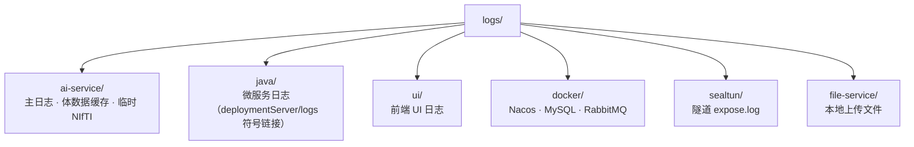

# 运行时中间文件目录

本目录存放项目运行产生的**日志、缓存、临时文件**，按模块分子目录。已在 `.gitignore` 中忽略（本 README 除外）。

## 目录结构



## 环境变量

由 `scripts/log_paths.sh` 导出，详见 `scripts/env.sh`。

常用：

```bash
LOG_ROOT=/path/to/WestChina-Cloud/logs
AI_LOG_PATH=$LOG_ROOT/ai-service/ai-service.log
SCHEME_B_CACHE_DIR=$LOG_ROOT/ai-service/cache/volumes
```

## 查看日志

```bash
tail -f logs/ai-service/ai-service.log
tail -f logs/java/ct.log
tail -f logs/ui/ui.log
```
