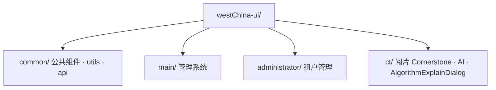

# WestChina-Cloud 前端

三个 Vue 2 子应用，生产环境由 `deploymentServer/local-ui-server.js` 统一在 **:5000** 提供：

| 模块 | 路径 | 说明 |
|------|------|------|
| main | `/main/` | 管理系统 |
| administrator | `/administrator/` | 租户管理 |
| ct | `/ct/` | CT 阅片（含 AI 病灶识别） |

## 开发

```bash
cd WestChina-Cloud/westChina-ui

# 安装依赖（任选其一）
npm install --legacy-peer-deps
# 或分模块：cd main && npm install && cd ../administrator && npm install && cd ../ct && npm install

# 启动（需分别开终端，或 npm run start-all）
cd main && npm run dev
cd administrator && npm run dev
cd ct && npm run dev
```

开发时各模块独立端口；生产构建后统一由 5000 端口访问。

## 生产构建

```bash
# 推荐：项目根目录
bash build_all.sh frontend-only

# 或手动
cd ct && npm run build:prod
cd ../main && npm run build:prod
cd ../administrator && npm run build:prod
# 产物复制到 deploymentServer/ui-dist/{ct,main,administrator}/
```

CT 模块构建需 `NODE_OPTIONS=--openssl-legacy-provider`（`build_all.sh` 已自动设置）。

## 目录结构



## 相关文档

- [docs/DEPLOY.md](../docs/DEPLOY.md)
- [ai-service/README.md](../ai-service/README.md)
